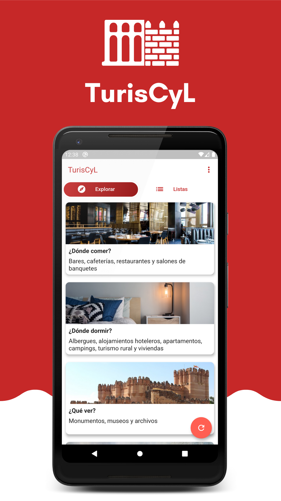
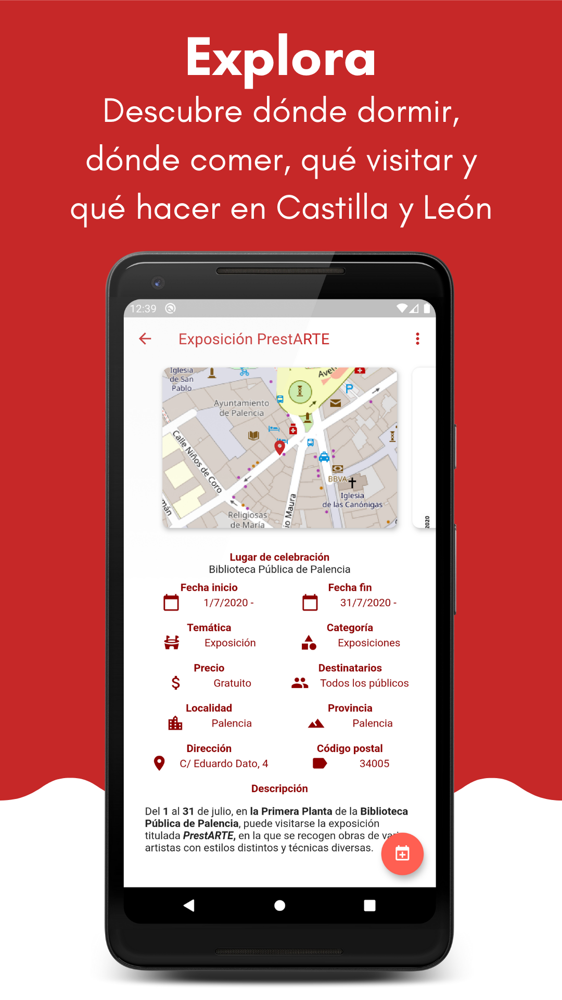
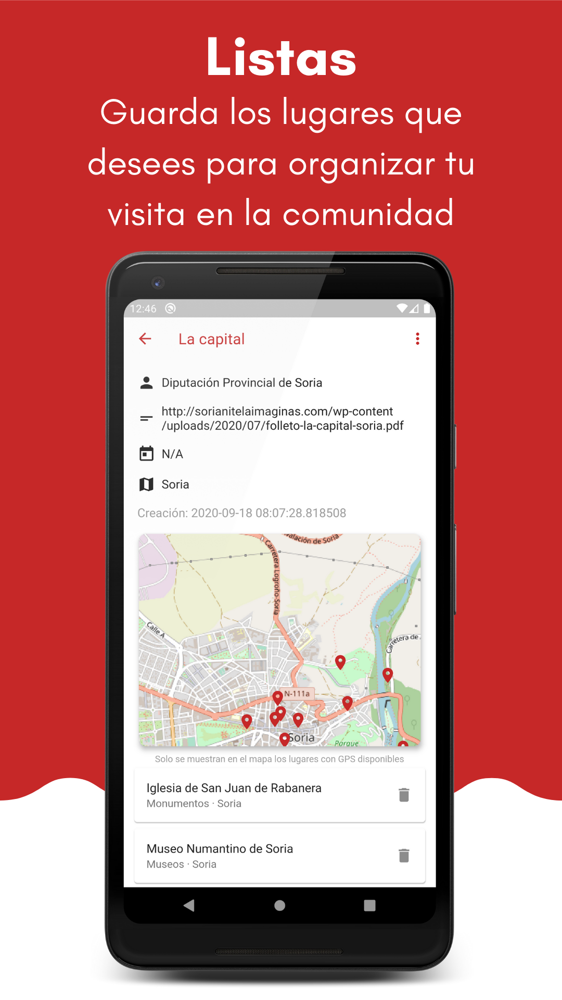
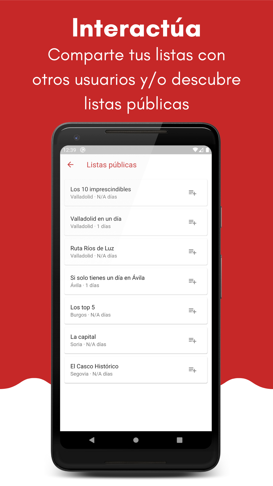
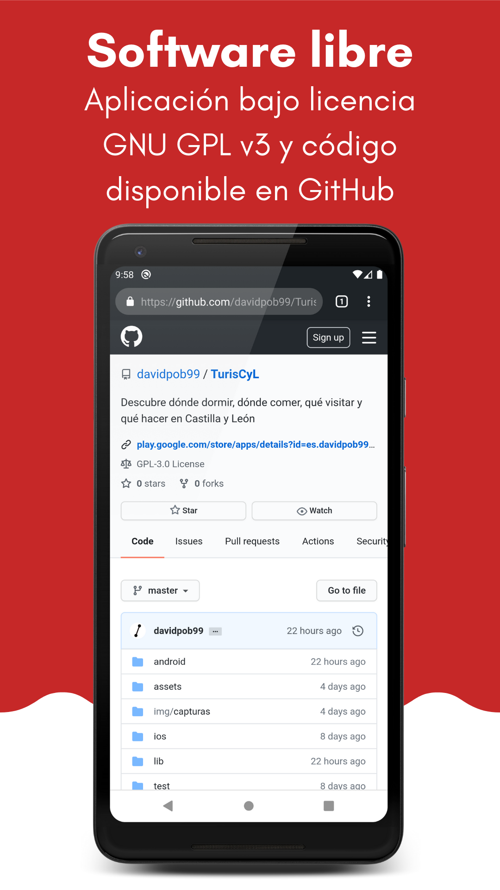

# TurisCyL

Aplicación Android (versión 4.1 o superior) para consultar la información turística de la comunidad
autónoma de Castilla y León. Concretamente, los lugares que se pueden encontrar son los siguientes:

* Registro de empresas que ofrecen otras actividades turísticas
* Registro de albergues turísticos
* Registro de alojamientos hoteleros
* Registro de apartamentos turísticos
* Registro de bares
* Registro de cafeterías
* Registro de campings
* Relación de eventos de la agenda cultural categorizados y geolocalizados
* Registro de guías de turismo
* Relación de monumentos de Castilla y León
* Directorio de Museos de Castilla y León
* Oficinas de información turística
* Registro de restaurantes
* Registro de salones de banquetes
* Registro de establecimientos de turismo activo
* Registro de establecimientos de turismo rural
* Registro de viviendas de uso turístico
* Directorio de Archivos de Castilla y León

Los datos se han extraído del [portal de Datos Abiertos](https://datosabiertos.jcyl.es) de la
[Junta de Castilla y León](http://www.jcyl.es).

Permite guardar los distintos lugares en listas para planificar de forma más cómoda y sencilla la
estancia en la comunidad. También es posible guardar los eventos en el calendario para no olvidarlos.

## Descarga

## Uso
La aplicación se divide en 2 pantallas principalmente (pestañas):
* Pestaña explorar: la principal de la app, la que se inicia una vez se abre
* Pestaña listas: sirve para gestionar las listas de elementos creadas o importadas

### Explorar
Es la vista dónde se pueden buscar los diferentes lugares turísticos. Para hacer más sencilla la navegación está dividida en diferentes categorías:
* __¿Dónde comer?__: bares, restaurantes, cafeterías y salones de banquetes
* __¿Dónde dormir?__: albergues, alojamientos hoteleros, apartamentos, campings, turismo rural y vivendas de uso turístico
* __¿Qué ver?__: monumentos, museos y archivos
* __¿Qué hacer?__: eventos, actividades turísticas, guías de turismo y turismo activo
* __Oficinas de turismo__
* __Espacios Naturales__: aplicación con información sobre los equipamientos de la Red de Espacios Naturales de Castilla y León [NaturCyL](https://github.com/davidpob99/NaturCyL)

### Listas
Sirve para gestionar las diferentes listas de lugares creadas o añadidas por el usuario. Es posible añadir listas de cualquiera de los siguientes medios:
* __Crear lista__: crea una lista desde cero, es decir, vacía. Para añadir elementos es necesario, a través de la _Pestaña explorar_, seleccionar cada elemento deseado
* __Listas públicas__: selecciona de una de las listas ya creadas por otros usuarios (ver _Listas públicas_)
* __Importar__: es posible añadir listas dado el código JSON de la misma (que se puede generar en el botón _Exportar_ de una lista concreta (3 puntos arriba a la izquierda))

#### Listas públicas
Dado que muchos de los visitantes de la comunidad pueden no conocer los elementos más emblemáticos o interesantes turísticamente, el objetivo de las listas públicas es dar unas guías ya creadas para planificar el viaje dependiendo de los días de la estancia.

Por defecto se han creado varias listas públicas obtenidas de los distintos ayuntamientos y diputaciones sobre las capitales de provincia de la comunidad. Aunque el objetivo es que sea colaborativo y que los usuarios las creen y compartan con los demás.

Proceso a seguir para colaborar con listas públicas:
1. Crear una lista
2. Añadir los diferentes elementos a la lista
3. En la vista de la lista, en el menú superior dar a _Exportar_
4. Rellenar el siguiente formulario: [https://forms.gle/hBB41WYUSw5FFjf27](https://forms.gle/hBB41WYUSw5FFjf27), donde se ha de pegar en _Datos de la lista_ el texto copiado en el paso anterior
5. Si la lista ha sido elegida se mostrará a los demás usuarios.

Las listas públicas son a su vez Datos Abiertos disponibles en el [siguiente enlace](https://api.jsonbin.io/b/5f63489a65b18913fc4dd003/latest) con licencia _Creative Commons Attribution 4.0 International_. De esta forma se mejora la reutilización de dichas listas y datos.

## Capturas de pantalla

## Licencia
La aplicación se distribuye siguiendo la [General Public License de la GNU, versión 3](https://www.gnu.org/licenses/gpl-3.0-standalone.html) o (a su elección) cualquier versión superior.
